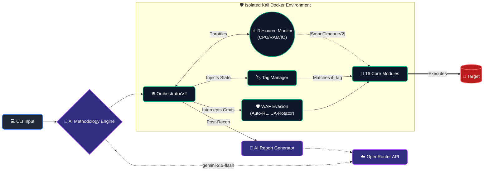
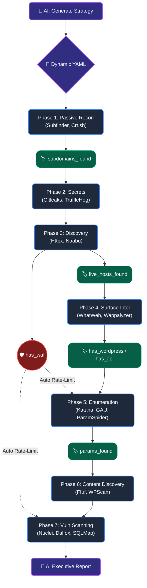

<div align="center">

# HuntForge 🎯
**Advanced, AI-Driven Autonomous Reconnaissance Orchestrator for Professional Bug Hunters**

[](https://www.python.org/downloads/)
[](LICENSE)
[](https://www.docker.com/)
[](https://openrouter.ai/)

**16 carefully curated tools. Autonomous WAF Evasion. Dynamic Tag-Flow. Zero noise.**  
HuntForge bridges the gap between chaotic enumeration scripts and precise, red-team exploitation logic.

[Features](#-key-features) • [Architecture](#-architecture--tag-flow) • [Installation](#-installation) • [Usage](#-usage) • [Dashboard](#-dashboard) • [Contributing](#-contributing)

---

</div>

## 📖 What is HuntForge?

HuntForge is a strict, containerized vulnerability discovery orchestrator built for the modern Bug Bounty landscape. It solves the "Kitchen Sink" problem — instead of blindly piping output across 50+ deprecated tools, HuntForge uses **AI-generated methodologies** and an **Adaptive Resource Scheduler** to run exactly what's needed, only when it makes sense.

### The HuntForge Philosophy
1. **Quality over Quantity**: 16 heavily curated, modern binaries — not 50 legacy wrappers.
2. **Autonomous Evasion**: Shift-left WAF detection in Phase 3. Automatic rate-limiting and User-Agent rotation on all downstream tools.
3. **No Hardware Freezes**: `ResourceAwareScheduler` + `SmartTimeoutV2` dynamically throttle concurrency and extend/kill processes based on real CPU, IO, and RAM.
4. **Smart Tag-Flow**: Non-linear execution — if Phase 1 emits `has_api`, Phase 4 conditionally unlocks API-specific tools.

---

## 🔥 Key Features

| Feature | Description |
|:---|:---|
| **AI Methodology Generation** | Describe your goal in plain English. OpenRouter (`gemini-2.5-flash`) writes a surgical YAML methodology instantly. |
| **Autonomous WAF Evasion** | Detects Akamai/Cloudflare/Imperva during `httpx` parsing. Automatically injects `-rl`, `--delay`, `--throttle`, and rotating browser User-Agents into all downstream tools. |
| **Interactive Dashboard** | Real-time Flask + SQLite web UI showing scan history, tag intelligence graphs, and budget consumption per scan. |
| **AI Executive Reports** | After scanning, generates a professional Markdown penetration report (Executive Summary, Critical Findings, Recommendations) via OpenRouter. |
| **SmartTimeoutV2** | Uses `psutil` to monitor subprocess CPU and IO activity. Extends actively-working tools indefinitely; kills truly hung processes. |
| **State Checkpointing** | Crash mid-scan? `huntforge resume target.com` picks up exactly where it stopped. |
| **Scope Enforcement** | Strict wildcard-based scope checking via `~/.huntforge/scope.json`. Blocks out-of-scope targets with manual override confirmation. |
| **Budget Tracking** | Tracks total HTTP requests and elapsed time per scan to ensure respectful, rate-limited engagement. |
| **Tag-Driven Conditional Execution** | Tools only run when prerequisite intelligence tags (`has_wordpress`, `params_found`, `has_waf`) are present. |

---

## 📐 Architecture & Tag-Flow

### Ecosystem Topology



### The Tag-Flow Execution Lifecycle



---

## 🚀 Installation

### Prerequisites
- Docker + Docker Compose V2
- Python 3.9+ (on host, for the CLI)
- Minimum Hardware: **1 GB RAM, 10 GB disk**

### 1. Environment Configuration
```bash
cp .env.example .env
# Edit .env with your OpenRouter API key:
#   OPENROUTER_API_KEY="sk-or-v1-..."
```

### 2. Deployment
```bash
# Build the isolated Kali container with all 16 tools
docker-compose up -d --build

# Provision tool binaries inside the container
docker exec -u root huntforge-kali python3 scripts/installer.py --profile professional
```

---

## 💻 Usage

All commands are run from the host machine via the `huntforge.py` CLI, which orchestrates execution inside the Docker container.

### CLI Reference

| Command | Description |
|:---|:---|
| `huntforge.py scan <domain>` | Run a full 7-phase reconnaissance scan |
| `huntforge.py scan <domain> --methodology <path>` | Scan using a custom methodology YAML |
| `huntforge.py ai "<prompt>"` | Generate a focused methodology via OpenRouter AI |
| `huntforge.py report <domain>` | Generate an executive AI penetration report |
| `huntforge.py resume <domain>` | Resume an interrupted scan from its checkpoint |
| `huntforge.py dashboard` | Launch the web dashboard on `http://localhost:5000` |
| `huntforge.py dashboard --port 8080` | Launch the dashboard on a custom port |

### Full Professional Scan
```bash
python3 huntforge.py scan target.com --methodology config/methodologies/professional.yaml
```

### AI-Generated Methodology
```bash
# Ask AI to write a methodology focused on your specific goal
python3 huntforge.py ai "find XSS and SQLi vulnerabilities in API endpoints"

# Execute the generated methodology
python3 huntforge.py scan target.com --methodology config/generated_methodology.yaml
```

### Generate Executive Report
After a scan completes, generate a professional AI-written report:
```bash
python3 huntforge.py report target.com
# Output: output/target.com/logs/ai_report.md
```

### Resume Interrupted Scans
```bash
python3 huntforge.py resume target.com
```

---

## 📊 Dashboard

HuntForge includes a built-in web dashboard for visualizing scan history, tag intelligence, and budget consumption.

```bash
python3 huntforge.py dashboard
# → http://localhost:5000
```

**Dashboard Features:**
- **Scan History Table** — View all past scans with status (RUNNING, COMPLETED, FAILED, INTERRUPTED), tag count, and timestamps
- **Scan Detail View** — Drill into any scan to see budget consumption (requests used / max), elapsed time, and output directory
- **Intelligence Graph** — Visual display of all discovered tags with confidence levels and source attribution (color-coded by confidence: high/medium/low)

---

## 🎓 The Toolset

| Phase | Tools | Purpose |
|:---|:---|:---|
| **1. Passive Recon** | `subfinder`, `crtsh` | Subdomain enumeration from passive sources |
| **2. Secrets & OSINT** | `gitleaks`, `trufflehog` | Leaked credentials and hardcoded secrets |
| **3. Live Discovery** | `httpx`, `naabu` | HTTP probing, port scanning, **WAF detection** |
| **4. Surface Intel** | `whatweb`, `wappalyzer` | Technology fingerprinting |
| **5. Enumeration** | `katana`, `gau`, `paramspider`, `arjun`, `graphql_voyager` | URL crawling, parameter discovery |
| **6. Content Discovery** | `ffuf`, `wpscan` | Directory fuzzing, WordPress scanning |
| **7. Vuln Scanning** | `nuclei`, `subjack`, `dalfox`, `sqlmap` | CVE detection, XSS, SQLi, subdomain takeover |

---

## 🛡️ WAF Evasion System

When `httpx` detects a WAF (Akamai, Cloudflare, Imperva, AWS, etc.), the framework autonomously injects tool-specific evasion switches:

| Tool | Injected Flags | Effect |
|:---|:---|:---|
| `nuclei` | `-rl 5`, `-H User-Agent: ...` | 5 req/sec, browser UA |
| `katana` | `-rl 5`, `-H User-Agent: ...` | 5 req/sec, browser UA |
| `ffuf` | `-rate 5`, `-H User-Agent: ...` | 5 req/sec, browser UA |
| `dalfox` | `--worker 5`, `--delay 200`, `-H ...` | 5 workers, 200ms delay |
| `wpscan` | `--throttle 200`, `--user-agent ...` | 200ms throttle |
| `sqlmap` | `--delay 0.2`, `--random-agent` | 200ms delay, random UA |
| `whatweb` | `--max-threads 2`, `--header ...` | 2 threads, browser UA |

This happens transparently — no manual configuration required.

---

## 📁 Project Structure

```
huntforge/
├── huntforge.py              # CLI entry point (scan, ai, report, resume, dashboard)
├── Dockerfile.kali            # Kali container with all 16 tools + Node.js
├── docker-compose.yml         # Container orchestration
├── requirements.txt           # Python dependencies
│
├── ai/
│   ├── methodology_engine.py  # AI methodology generation via OpenRouter
│   ├── openrouter_helper.py   # Shared OpenRouter API client
│   └── report_generator.py    # AI executive report synthesis
│
├── core/
│   ├── orchestrator_v2.py     # Main 7-phase execution engine
│   ├── resource_aware_scheduler.py  # CPU/RAM adaptive throttling
│   ├── smart_timeout_v2.py    # psutil-based process monitoring
│   ├── tag_manager.py         # Intelligence tag system
│   ├── budget_tracker.py      # Request/time budget enforcement
│   ├── scope_enforcer.py      # Wildcard scope validation
│   ├── scan_history.py        # SQLite scan metadata recording
│   ├── docker_runner.py       # Container execution wrapper
│   ├── hf_logger.py           # Structured logging
│   ├── siem_formatter.py      # Log formatting for SIEM
│   └── exceptions.py          # Custom exception hierarchy
│
├── modules/
│   ├── base_module.py         # Abstract base + WAF evasion interceptor
│   ├── passive/               # subfinder, crtsh
│   ├── secrets/               # gitleaks, trufflehog
│   ├── discovery/             # httpx, naabu
│   ├── surface_intel/         # whatweb, wappalyzer
│   ├── enumeration/           # katana, gau, paramspider, arjun, graphql_voyager
│   ├── content_discovery/     # ffuf, wpscan
│   └── vuln_scan/             # nuclei, dalfox, sqlmap, subjack
│
├── config/
│   ├── default_methodology.yaml     # Full 7-phase methodology
│   └── methodologies/
│       └── professional.yaml        # Curated 16-tool methodology
│
├── dashboard/
│   ├── app.py                 # Flask web server
│   ├── static/style.css       # Dashboard styling
│   └── templates/             # Jinja2 HTML templates
│
├── data/
│   ├── tool_profiles.yaml     # Resource profiles per tool
│   └── tool_fingerprints.json # Binary detection signatures
│
└── scripts/
    └── installer.py           # Container tool provisioner
```

---

## 🤝 Contributing

We welcome contributions to make HuntForge the most robust red-team reconnaissance framework available.

**Accepted PRs:**
- ✅ Improving WAF signature detection in `modules/discovery/httpx.py`
- ✅ Adding new evasion switches in `modules/base_module.py`
- ✅ Enhancing AI prompts in `ai/methodology_engine.py` and `ai/report_generator.py`
- ✅ Creating new `methodologies/*.yaml` for specific attack vectors
- ✅ Expanding `emit_tags()` in any module to extract richer intelligence

**Rejected PRs:**
- ❌ Re-adding deprecated tools (Nikto, Dirb, legacy Amass)
- ❌ Committing `.env`, `output/`, or `__pycache__/` into the repository

**How to contribute:**
1. Fork the repository
2. Read `core/orchestrator_v2.py` and `modules/base_module.py`
3. Open an issue describing your proposed change
4. Submit a PR against `main`

---

<div align="center">
  <b>Happy Bug Hunting.</b> 🎯
</div>
