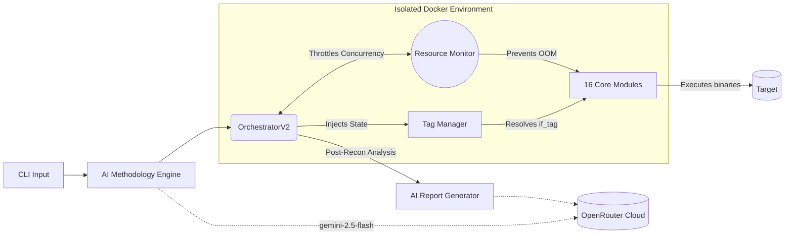
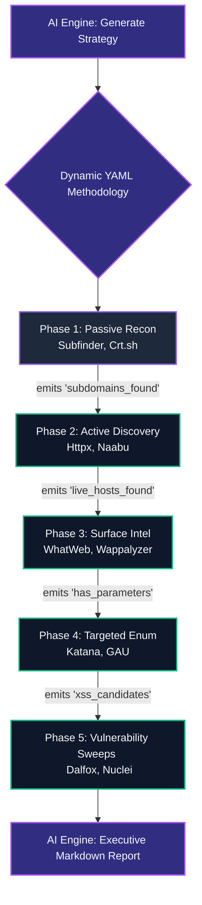

<div align="center">

# HuntForge 🎯
**Advanced, AI-Driven Reconnaissance Orchestrator for Professional Bug Hunters**

[](https://www.python.org/downloads/)
[](LICENSE)
[](https://www.docker.com/)
[](https://openrouter.ai/)

**16 carefully curated tools. Dynamic AI workflows. Zero noise.**  
HuntForge bridges the gap between chaotic enumeration and precise, red-team exploitation.

[Quick Start](#-quick-start) • [Architecture](#-architecture-and-diagrams) • [Installation](#-installation) • [Contributing](#-contributing)

---

</div>

## 📖 What is HuntForge?

HuntForge is a strict, containerized vulnerability discovery framework designed to eliminate the "Kitchen Sink" problem in bug bounty hunting. While amateur scripts blindly pipe output across 50+ deprecated tools, HuntForge employs **Artificial Intelligence** and an **Adaptive Resource Scheduler** to run exactly what is needed, only when it makes sense.

### The HuntForge Philosophy
1. **No Hardware Freezes**: Our `ResourceAwareScheduler` dynamically throttles container concurrency based on true CPU and Memory availability in your VPS environment.
2. **AI-Orchestrated Constraints**: Tell HuntForge *"Focus only on finding XSS vulnerabilities"* in natural language, and our OpenRouter integration constructs a precise, topological YAML methodology in seconds.
3. **Smart Tag-Flow**: Execution isn't linear. If `subfinder` flags `has_api`, the orchestrator conditionally unlocks `katana` exclusively for API fuzzing. 

---

## 📐 Architecture and Diagrams

HuntForge is built on a highly modular, decoupled architecture where AI, memory management, and binary execution are isolated.

### Ecosystem Topology



### The Tag-Flow Execution Lifecycle



---

## 🎓 The "Quality Over Quantity" Toolset

Professional hunting relies on precision. We have stripped HuntForge down strictly to these **16 world-class binaries**:

- **Passive Intelligence**: `subfinder`, `crtsh`
- **Asset Live Discovery**: `httpx`, `naabu`
- **Surface Fingerprinting**: `whatweb`, `wappalyzer`
- **Crawling & Enumeration**: `katana`, `gau`, `paramspider`, `arjun`, `graphql_voyager`
- **Targeted Content Fuzzing**: `ffuf`, `wpscan`
- **Vulnerability Scanning**: `nuclei`, `subjack`, `dalfox`, `sqlmap`

*(Note: Legacy utilities like `dirsearch`, `nikto`, and `amass` have been completely eradicated to reduce triage bloat).*

---

## 🚀 Quick Start

### 1. Prerequisites
- Docker + Docker Compose
- `python 3.9+`
- Minimal VPS requirements: **1GB RAM, 10GB Storage** *(Adaptive Scheduling allows low footprints!)*

### 2. Environment Configuration
Create a `.env` file at the root of the project to enable the OpenRouter AI:
```env
OPENROUTER_API_KEY="sk-or-v1-..."
OPENROUTER_MODEL="google/gemini-2.5-flash"
OPENROUTER_API_URL="https://openrouter.ai/api/v1/chat/completions"
# Add standard API keys for Shodan, GitHub, etc., here.
```

### 3. Installation
Boot the environment and compile the tools natively inside the Kali container:
```bash
# Provision isolated environment
docker compose up -d

# Install framework bindings and 16 active binaries
docker exec -u root huntforge-kali ./scripts/installer.py --profile professional
```

### 4. Running Custom Methodologies
Want to spin up an ephemeral XSS discovery pipeline? Let the AI build the plan inline.
```bash
# 1. Ask OpenRouter to build a methodology
docker exec huntforge-kali /home/huntforge/venv/bin/python3 huntforge.py ai "focus only on xss findings"

# 2. Fire the orchestrator using the dynamically generated yaml
docker exec huntforge-kali /home/huntforge/venv/bin/python3 huntforge.py scan soundcloud.com --methodology config/generated_methodology.yaml
```

---

## 🛠 Features

* **OpenRouter Fallbacks**: Connects directly to `gemini-2.5-flash` natively without requiring local LLM weights chewing up GPU resources.
* **Smart Methodology Schema Resistance**: Fully tolerant to AI-hallucinated list dicts; strictly maps `if_tag` against `tags_emitted`.
* **State Checkpointing**: Run Phase 1-3. Go to sleep. Wake up and type `huntforge resume target.com`. It picks right back up precisely where it died.
* **Report Generation**: Automatically aggregates `scan_events` and `.jsonl` artifacts to synthesize executive impact reports.

---

## 🤝 Contributing

We are actively seeking aggressive pull requests!

However, **HuntForge is an opinionated framework designed for absolute noise-reduction.** We are not interested in hoarding binaries. 

**Acceptable PRs include:**
- ✅ Fixing syntax anomalies in adaptive `OrchestratorV2` logic.
- ✅ Expanding OpenRouter prompts for better zero-shot vulnerability heuristics.
- ✅ Creating new `professional.yaml` workflows for highly specific vectors (e.g. Server-Side Request Forgery logic chains).
- ✅ Improving native parsing in `modules/*.py` to extract richer metadata into `tag_manager`.

**Rejected PRs include:**
- ❌ Re-adding deprecated wrappers for tools older than 4 years (e.g., Nikto, Dirb).
- ❌ Committing `__pycache__` data or local `.env` variables.

**How to get started:**
1. Clone the project.
2. Open an issue detailing the module/logic gap.
3. Keep logic strictly containerized within existing API mappings.

---

<div align="center">
  <b>Happy Bug Hunting.</b> 🎯
</div>
