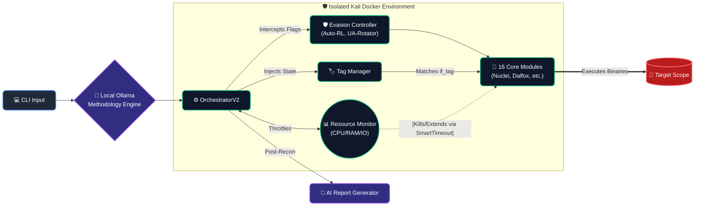
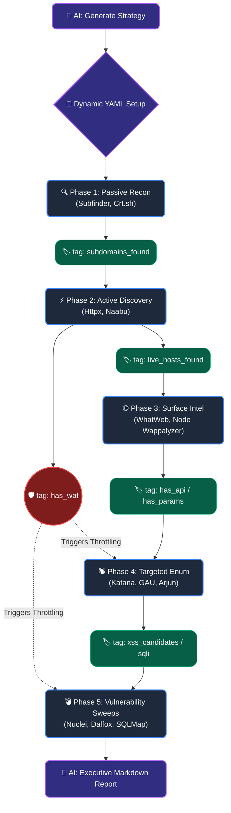

<div align="center">

# HuntForge 🎯
**Advanced, AI-Driven Autonomous Reconnaissance Orchestrator for Professional Bug Hunters**

[](https://www.python.org/downloads/)
[](LICENSE)
[](https://www.docker.com/)
[](https://ollama.com/)

**16 carefully curated tools. Complete Autonomous WAF Evasion. Dynamic Tag-Flow. Zero noise.**  
HuntForge bridges the gap between chaotic unguided enumeration scripts and precise, red-team exploitation logic.

[Features](#-key-features) • [Architecture](#-architecture--tag-flow) • [Installation](#-installation) • [Usage](#-usage) • [Contributing](#-contributing)

---

</div>

## 📖 What is HuntForge?

HuntForge is a strict, containerized vulnerability discovery orchestrator built for the modern Bug Bounty landscape. It solves the "Kitchen Sink" problem by avoiding blind `cat | tool_a | tool_b` bash scripts. 

Instead, HuntForge employs **Artificial Intelligence (via local Ollama integration)** to construct dynamic, surgical methodologies based on natural language objectives, and executes them via an **Adaptive Resource Scheduler** that continuously monitors your hardware limits.

### The HuntForge Philosophy
1. **Quality over Quantity**: We stripped out legacy tools (Nikto, Dirb, older wrappers). We employ exactly 16 heavily maintained, modern binaries (ProjectDiscovery, Ffuf, Sqlmap, Dalfox, etc.).
2. **Autonomous Evasion**: Don't lose hours to silent 403 blocks. The framework shift-lefts WAF detection (Akamai, Cloudflare, AWS) into Phase 3 and natively intercepts heavy tools (Nuclei, Katana, Ffuf) to apply rate limits and dynamic User-Agents.
3. **No Hardware Freezes**: The `ResourceAwareScheduler` and `SmartTimeoutV2` dynamically throttle container concurrency and kill zombie processes based on true CPU, IO, and Memory availability in your VPS environment.
4. **Smart Tag-Flow**: Execution isn't linear. If Phase 1 flags `has_api`, the orchestrator conditionally unlocks Phase 4 tools tailored exclusively for APIs.

---

## 🔥 Key Features

- **Shift-Left WAF Detection**: Detects Akamai/Cloudflare inside Httpx parsing, instantly flagging the framework to decelerate fuzzers.
- **Dynamic Command Interception**: Core module wrappers dynamically append `-rl` loops, timeout overrides, and browser heuristics if targets become hostile.
- **Total Local AI Integration**: Seamless integration with local Ollama (`llama3`, `mistral`) for building on-the-fly ephemeral methodologies and synthesizing post-scan markdown reports—**zero API cost and full data privacy.**
- **Infinite Run Extensions**: `SmartTimeoutV2` watches subprocess resource/IO hooks; if Nuclei or Dalfox are visibly working and making progress, they are intelligently extended rather than forcefully terminated.
- **State Checkpointing**: System crash? VPS reboot? Run `huntforge.py resume target.com`. It picks up exactly where it died.

---

## 📐 Architecture & Tag-Flow

HuntForge is built on a highly modular, decoupled architecture where AI, memory management, and binary execution are isolated from each other.

### Ecosystem Topology



### The Tag-Flow Execution Lifecycle



---

## 🚀 Installation

### 1. Prerequisites
- Docker + Docker Compose V2
- `python 3.9+` (on host)
- Local inference server: Ollama (Optional but highly recommended for AI features)
- Minimum Hardware: **1GB RAM, 10GB Storage** *(Adaptive Scheduler will operate flawlessly within a tiny VPS).*

### 2. Environment Configuration
Create a `.env` file at the root of the project to customize API keys for Subfinder, Github, etc.
```env
# Optional: Setup Ollama if running on a remote cluster
OLLAMA_HOST="http://localhost:11434"
```

### 3. Deployment
Boot the environment and compile the binaries directly inside the hardened container.
```bash
# Provision isolated Kali environment
docker-compose up -d --build

# Run the system methodology provisioner 
docker exec -u root huntforge-kali ./scripts/installer.py --profile professional
```

---

## 💻 Usage

HuntForge uses a singular CLI script to drive the entire container lifecycle seamlessly from the host machine. Run all commands directly via `huntforge.py` (which internally wraps `docker exec` logic).

### Professional Default Scan
Run the entire 16-tool standard methodology loop across all 7 Phases.
```bash
python3 huntforge.py scan target.com --methodology config/methodologies/professional.yaml
```

### AI-Generated Ephemeral Scans
Tell Ollama precisely what you are hunting for. The AI will write a disposable YAML file matching your needs and immediately execute it.
```bash
# 1. Ask AI to write a strict plan
python3 huntforge.py ai "focus only on finding heavy PII exposure and S3 misconfigurations"

# 2. Fire the orchestrator 
python3 huntforge.py scan target.com --methodology config/generated_methodology.yaml
```

### Resume Interrupted Scans
Did your SSH session drop or VPS reboot during Nuclei scanning? 
```bash
python3 huntforge.py resume target.com
```

---

## 🎓 The "Quality Over Quantity" Toolset

Professional hunting relies on precision. We have stripped HuntForge down strictly to these 16 world-class binaries:

| Phase Category | Core Native Binaries Used |
| :--- | :--- |
| **Passive Intelligence** | `subfinder`, `crtsh` |
| **Live Asset Discovery** | `httpx`, `naabu` |
| **Surface Fingerprinting** | `whatweb`, `wappalyzer` (Node.js Build) |
| **Crawling & Enumeration** | `katana`, `gau`, `paramspider`, `arjun`, `graphql_voyager` |
| **Content Discovery** | `ffuf`, `wpscan`|
| **Vulnerability Scanning** | `nuclei`, `subjack`, `dalfox`, `sqlmap` |

---

## 🤝 Contributing

We are actively seeking pull requests to make HuntForge the most robust Red-Teaming infrastructure tool available!

However, **HuntForge is a deeply opinionated framework designed for absolute noise-reduction.** We do not accept additions for archaic bloatware tools.

**Acceptable PRs include:**
- ✅ Fixing/Enhancing syntax anomalies in the `ResourceAwareScheduler` or `SmartTimeoutV2` logic.
- ✅ Expanding AI Prompts for Ollama syntax and context.
- ✅ Expanding module `emit_tags` logic to extract richer metadata (e.g., detecting new AWS/Azure headers for `has_waf`).
- ✅ Adding new `methodologies/*.yaml` templates for specific vulnerability vectors.

**Rejected PRs include:**
- ❌ Re-adding deprecated wrappers or unmaintained tools (e.g., Nikto, Dirb, legacy Amass plugins).
- ❌ Hardcoding target domains, IP restrictions, or local `.env` variables into Git.

**How to get started:**
1. Clone the project.
2. Read the logic inside `/core/orchestrator_v2.py`.
3. Open an issue detailing your proposed heuristic fix.
4. Keep logic strictly wrapped inside `/modules/base_module.py` bounds!

---

<div align="center">
  <b>Happy Bug Hunting. Keep it clean.</b> 🎯
</div>
